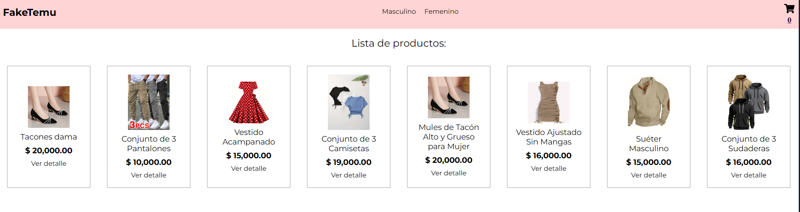

## FakeTemu

#### Fake temu es una simulacion de una tienda online de moda.

Utiliza Vite, React y Firebase.



Luego de copiar el repositorio deben ejecutar el comando para instalar las dependencias.

```
npm install
```

Deben crear un archivo .env en la raiz del proyecto y agregarle sus credenciales de Firebase Firestore.
